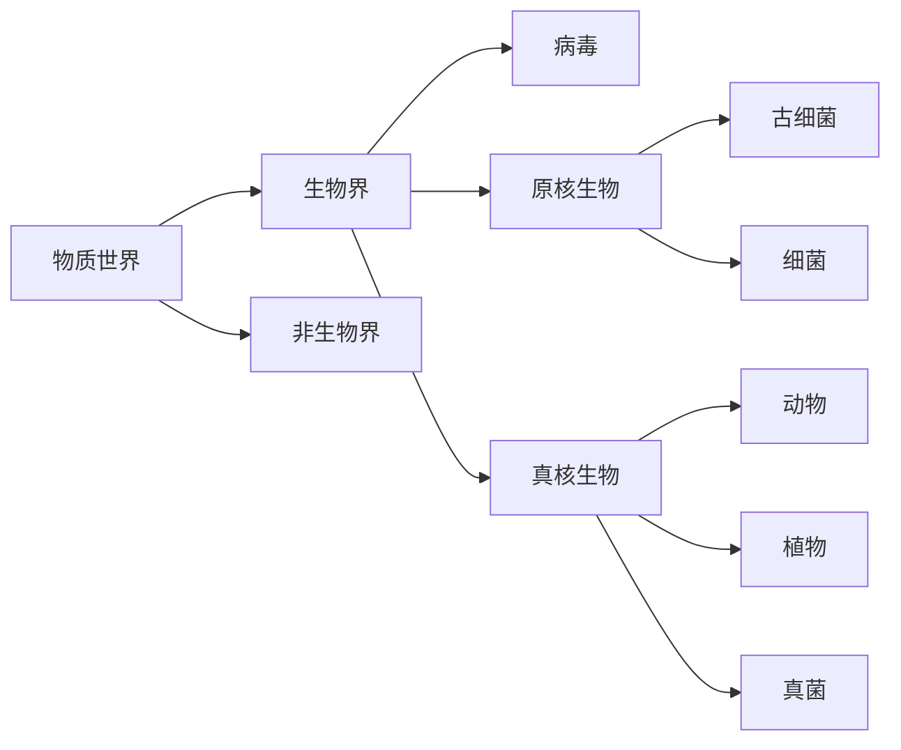

# 动物分类&结构

## 分类

## 动物分类

|ZH|EN|
|-|-|
|界|Kingdom|
|门|Phylum|
|纲|Class|
|目|Order|
|科|Family|
|属|Genus|
|种|Species|

动物界十大门：

- 原生动物门
- 多孔动物门
- 腔肠动物门
- 扁形动物门
- 线虫动物门
- 环节动物门
- 软体动物门
- 节肢动物门
- 棘皮动物门
- 脊索动物门

## 学名

> **双名法**
> ——林奈

以拉丁文命名

|属名|种本名|亚种名|命名人|中文|
|-|-|-|-|-|
|*Mus*|*musculus*| - |Linnaeus|小家鼠|

- **亚种：**同种地理充分隔离形成
- **品种：**人工选择形成，有新性状

## 组织

- 上皮组织
  - 被覆上皮
  - 腺上皮
  - 感觉上皮
- 结缔组织
  - 疏松结缔组织
  - 致密结缔组织
  - 脂肪组织
  - 软骨组织
  - 骨组织
  - 血液
- 肌肉组织
  - 横纹肌
  - 心肌
  - 斜纹肌
  - 平滑肌
- 神经组织
