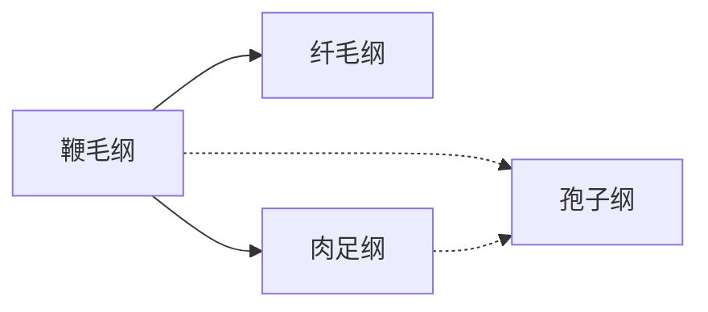

# 原生动物

## 主要特征

|||
|-|-|
|基本特征：|真和单细胞个体或群体|
|运动：|鞭毛/纤毛/伪足/无|
|营养：|光合营养/动物性营养/腐生性营养|
|无性生殖：|二分裂/多分裂/质裂/出芽/包囊/孢子|
|有性生殖：|配子接合|

## 分类与进化

### 鞭毛纲

|纲|物种|特征|运动|营养|无性生殖|有性生殖|
|-|-|-|-|-|-|-|
|鞭毛纲|眼虫|光感受器|鞭毛|自养/异养（寄生）|纵二分裂/包囊||
|肉足纲|大变形虫|变形运动|伪足|异养|横二分裂||
