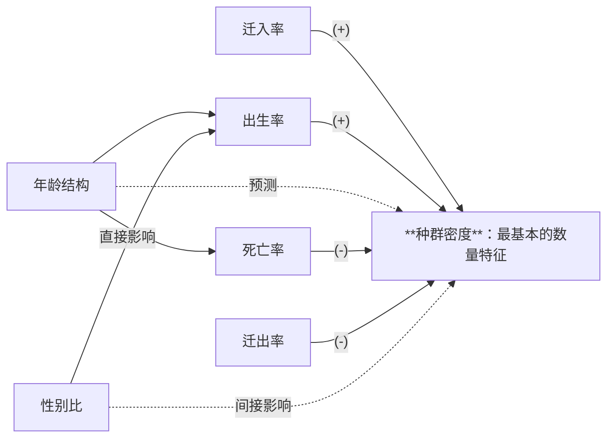
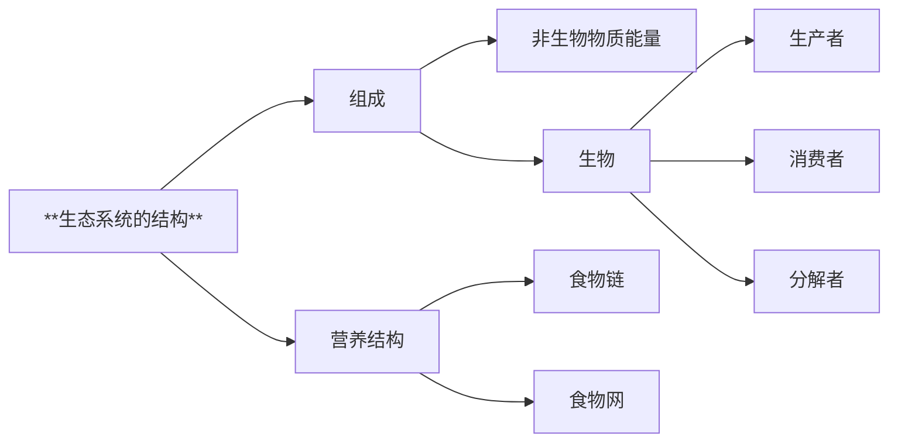
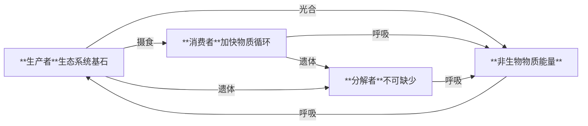

# 选必2

## 种群及其动态

**种群密度**：最基本的数量特征
调查方法

- 逐个计数
- 样方法
- 标记重捕法

环境容纳量$K$：不是最大个体数
最大收成：维持在$\frac{K}{2}$

影响种群数量变化

- 非生物（一般为非密度制约因素）
- 生物（一般为密度制约因素）
  - 种内
    - 竞争
  - 种间
    - 竞争
    - 捕食
    - 寄生

## 群落及其演替

**物种组成**：区别不同群落重要特征
**物种丰富度**：一个群落物种数目

种间关系：

- 原始合作
- 互利共生
- 竞争
- 捕食
- 寄生

空间结构：

- 垂直结构
- 水平结构

**生态位**：一个物种在群落中的地位和作用，包括所处空间位置、占用资源情况，以及与其他物种的关系等
意义：占据相对稳定的生态位，有利于充分利用环境资源，是物种之间、生物与环境协同进化的结果

研究土壤中小动物丰富

**取样器取样法**：土壤动物活动能力较强，身体微小
统计物种数目：

- 记名计算法
- 目测估计法

## 生态系统及其稳定性

|陆地生物群落|分布|物种组成|群落结构|
|-|-|-|-|
|荒漠|极度干旱|少|简单|
|草原|半干旱|较少|较简单|
|森林|湿润|多|复杂|

群落演替：

- 初生演替
- 次生演替

影响：

- 群落外部环境
- 生物
- 人（按不同于自然演替方向进行）

## 人与环境
