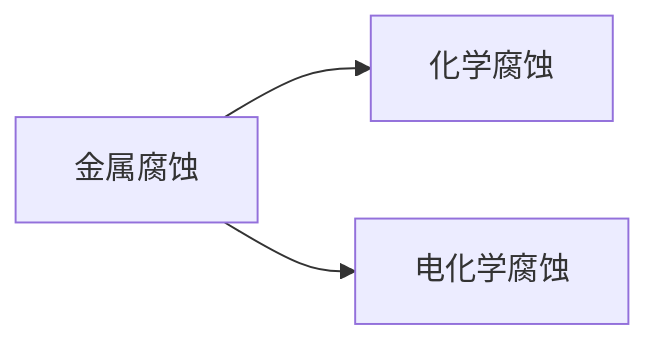

# 选择性必修1

---

- [选择性必修1](#选择性必修1)
  - [化学反应与能量转换](#化学反应与能量转换)
    - [化学反应的热效应](#化学反应的热效应)
      - [化学反应的反应热](#化学反应的反应热)
      - [化学反应内能变化与焓变](#化学反应内能变化与焓变)
      - [热化学方程式](#热化学方程式)
      - [焓变计算](#焓变计算)
      - [摩尔燃烧焓](#摩尔燃烧焓)
    - [化学能转化为电能——电池](#化学能转化为电能电池)
    - [原电池的工作原理](#原电池的工作原理)
      - [化学电源](#化学电源)
    - [电能转化为化学能——电解](#电能转化为化学能电解)
    - [金属的腐蚀与防护](#金属的腐蚀与防护)
      - [金属电化学腐蚀的原理](#金属电化学腐蚀的原理)
      - [金属腐蚀的防护](#金属腐蚀的防护)
      - [电化学腐蚀原理应用](#电化学腐蚀原理应用)

---

## 化学反应与能量转换

---

### 化学反应的热效应

---

|key|value|unit|
|:---:|:---:|:---:|
|反应热|反应释放/吸收的热量|$\rm{Q}$|
|内能|体系内物质所含微观粒子的能量总和|$\rm{U}$|
|焓|等压反应的反应热|$\rm{H}$ |

#### 化学反应的反应热

**反应热**：反应释放/吸收D的热量称为该反应在此温度下的热效应，简称反应热

$Q=-C(T_2-T_1)=-cm\Delta T$

$$\left\{\begin{aligned} Q & > & 0 & \Longrightarrow & 吸热 \\ Q & < & 0 & \Longrightarrow & 放热\end{aligned}\right. $$

|Key|Value|Unit|
|:---:|:---:|:---:|
|$C$ |热容|$\rm{J\cdot K^{-1}}$|
|$c$ |比热容 |$\rm{kJ\cdot K^{-1} \cdot kg^{-1}}$|

#### 化学反应内能变化与焓变

**内能**：体系内物质所含微观粒子的能量总和

> 与物质种类，数量，聚集状态；体系温度，压强有关

$\Delta U=U（反应产物）-U（反应物）$

$$\left\{\begin{aligned}\Delta U & > & 0 & \Longrightarrow & 吸热 \\\Delta U & < & 0 & \Longrightarrow & 放热\end{aligned}\right. $$

> 内能的变化等于反应热和功的加和

$\Delta U=Q+W$

特别地，如果体系没有做功：$\Delta U=Q$

**焓**：等压反应的反应热**焓变**：反应产物的焓与

> 与物质种类，数量，聚集状态；体系温度，压强有关

如果反应中能量变化没有与电能、光能等其他形式的能量转化关系，则焓变化与反应热相同：$\Delta H=Q_p$

#### 热化学方程式

热化学方程式：同时表示物质变化、焓变

$\ce{H2(g) + \frac{1}{2}O2(g) =H2O(l)}\space\space\Delta H(298K)=-285.8\rm{kJ\cdot mol^{-1}}$

|Key |Value|
|:---:|:---:|
|g|气态|
|l|液态|
|s|固态|
|aq|水溶液溶质 |

- 注明聚集状态
- $\Delta H$的单位是$\rm{J\cdot mol^{-1}}$或$\rm{kJ\cdot mol^{-1}}$
- 根据焓的性质各物质化学式前系数加倍则$\Delta H$数值的绝对值也加倍
- 指明反应温度和压强（默认$298\rm{K}, 101\rm{kPa}$）

#### 焓变计算

**盖斯定律**：一个化学反应无论是一步完成还是分几步完成，反应热都是一样的

#### 摩尔燃烧焓

**摩尔燃烧焓**在一定反应温度和压强条件下，$1\rm{mol}$ 纯物质完全氧化为同温度下的指定产物时的焓变

---

### 化学能转化为电能——电池

---

### 原电池的工作原理

**半反应**：发生失去/获得电子的反应（氧化/还原），分别相当于氧化还原反应的一半

**电极反应**：在电极上进行的半反应

**电池反应**：电池的两个电极反应组成电池的总反应

#### 化学电源

- 锌锰干电池

$\ce{Zn + 2MnO2 + H2O = ZnO + 2MnOOH}$

- 酸性锌锰干电池：

  $$\left\{\begin{aligned}& 负极：\ce{Zn - 2e^- = Zn^{2+}} \\& 正极：\ce{2MnO2 + 2NH4^+ +2e^- = Mn2O3 + 2NH3 + H2O}\end{aligned}\right. $$

- 碱性锌锰干电池：

$$\left\{ \begin{aligned} & 负极：\ce{Zn +2OH^- -2e^- = ZnO + H2O} \\ & 正极：\ce{2MnO2 + 2H2O + 2e^- = 2MnOOH + 2OH^-} \end{aligned} \right. $$

- 铅蓄电池

$\ce{Pb + PbO2 + 2H2SO4 <=>T[放电][充电]2PbSO4 + 2H2O}$

$$\left\{ \begin{aligned} & 负极：\ce{Pb + SO4^{2-} -2e^- = PbSO4} \\ & 正极：\ce{PbO2 + 4H+ +SO4^{2-} + 2e^- = PbSO4 + 2H2O} \end{aligned} \right. $$

- 燃料电池

$\ce{2H2 + O2 = 2H2O}$

$$\left\{ \begin{aligned} & 负极：\ce{2H2 + 4OH^- -4e^- = 4H2O} \\ & 正极：\ce{O2 + 2H2O + 4e^- = 4OH-} \end{aligned} \right. $$

---

### 电能转化为化学能——电解

---

**电解**：将电能转化为化学能的过程

**电解**：将直流电通过熔融电解质或电解质溶液，在两个电极上分别发生氧化反应和还原反应的过程

**阳极**：发生氧化反应的电极
**阴极**：发生还原反应的电极

- 电解熔融氯化钠

$\ce{2NaCl ->T[通电]2Na + Cl2 ^}$

$$
\left\{ \begin{aligned} & 阴极：\ce{2Na+ + 2e- = 2Na} \\ & 阳极：\ce{2Cl- - 2e- = Cl2 ^} \end{aligned} \right.
$$

- 电解食盐水

$\ce{2NaCl + 2H2O ->T[通电]\underbrace{2NaOH + H2 ^}_{阴极产物} + \underbrace{Cl2 ^}_{阳极产物}}$

$$
\left\{ \begin{aligned} & 阴极：\ce{2H+ + 2e- = H2 ^} \\ & 阳极：\ce{2Cl- - 2e- = Cl2 ^} \end{aligned} \right.$$

> $\ce{H2O <=> H+ + OH-}，$阴极$\ce{H+}$浓度变小，水的电离平衡向生成$\ce{H+ + OH-}$的方向移动

- 铜的电解精炼

$$
\left\{ \begin{aligned} & 阴极：\ce{Cu - 2e- = Cu^{2+}} \\ & 阳极：\ce{Cu^{2+} + 2e- = Cu} \end{aligned} \right.$$

> 粗铜为阳极，精铜为阴极，粗铜中的活泼金属活泼金属进入溶液，银、铂、金等不发生反应，沉积为阳极泥

- 电镀

$$
\left\{ \begin{aligned} & 阴极：\ce{Cu - 2e- = Cu^{2+}} \\ & 阳极：\ce{Cu^{2+} + 2e- = Cu} \end{aligned} \right.$$

> 镀件为阴极材料，镀层金属为阳极材料，利用其氧化溶液提供镀层金属

- 铅蓄电池充电

- 液流电池

---

### 金属的腐蚀与防护

---

#### 金属电化学腐蚀的原理

**金属腐蚀**：金属表面与周围物质发生氧化还原反应而遭到破坏

铁-铜

- 铁发生氧化反应成为负极反应物

  $\ce{Fe - 2e- = Fe^{2+}}$

- 铜板上主要发生水膜中溶解的氧气

  $\ce{O2 + 2H2O + 4e- = 4OH-}$

- $\ce{Fe^{2+}}$与$\ce{OH-}$结合为氢氧化亚铁进而反应为 氢氧化铁

  $\ce{4Fe(OH)2 + 2H2O + O2 = 4Fe(OH)3}$

**吸氧腐蚀**：环境消耗的物质主要是氧气
**析氢腐蚀**：水膜酸度较高，正极可能主要是$\ce{H+}$被还原为$\ce{H2}$析出

#### 金属腐蚀的防护

- 加上保护层与外界隔开
  - 油漆、搪瓷、陶瓷、沥青、塑料、橡胶
  - 电镀（镀层损坏时形成原电池，镀层金属更活泼——被保护金属成为正极，保护；镀层金属更不活泼——被保护金属成为负极，腐蚀）
- 阻止成为原电池负极反应物
  - 将活泼性较强的金属作为保护极，构成原电池，牺牲阳极
  - 与直流电相连，成为负极
- 钝化

#### 电化学腐蚀原理应用

- 测定空气中氧气含量
- 食品防腐剂
- 保暖贴
  > 空气中的氧气进入，活性炭为正极，食盐水为离子导体，氧气、铁粉通过无数微小原电池快速反应，蛭石为保温材料。反应结束后主要含有炭粉、氯化钠固体、三氧化二铁、镁盐、铝盐
- 处理工业废水
  $\left\{ \begin{aligned} & 负极： && \ce{Fe + 2e- = Fe^{2+}} \\ & 正极： && \ce{2H+ + 2e- = H2 ^ &&（酸性条件）}\\&&& \ce{O2 + 2H2O + 4e- = 4OH- &&（碱性或中性条件）} \end{aligned} \right.$
