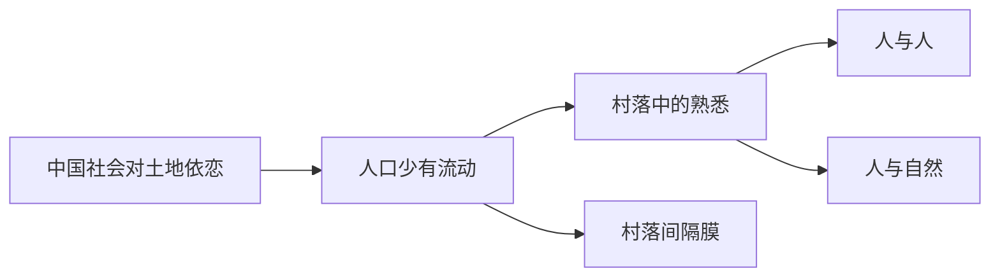

# 乡土中国

## 1. 乡土社会基本特点（一）

```mermaid
graph LR
中国社会对土地依恋 --> 人口少有流动 --> 村落中的熟悉 --> 人与人
村落中的熟悉 --> 人与自然
人口少有流动 --> 村落间隔膜
```

## 2. 乡土社会不需要文字及其时空特征（二、三）

```mermaid
graph LR
乡下人知识不及人 --> 熟人社会互相熟悉 --> 文字具有局限性 --> 熟人社会无使用文字必要 --> 现代化与文字下乡
```
```mermaid
graph LR
```

## 3. 乡土社会人际关系（四、五）

## 4. 乡土社会社群特点（六、七）

## 5. 乡土社会秩序（八、九）

## 6. 乡土社会传统权力（十、十一）

## 7. 乡土社会变迁权力（十二、十三、十四）
