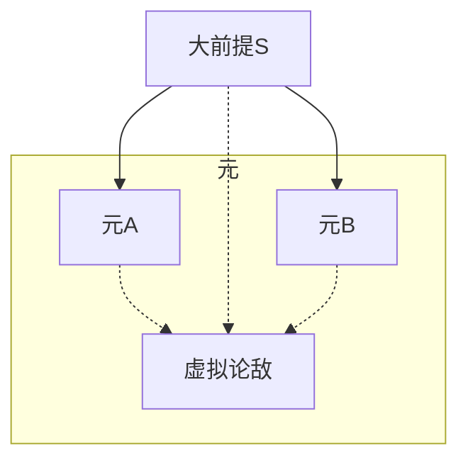
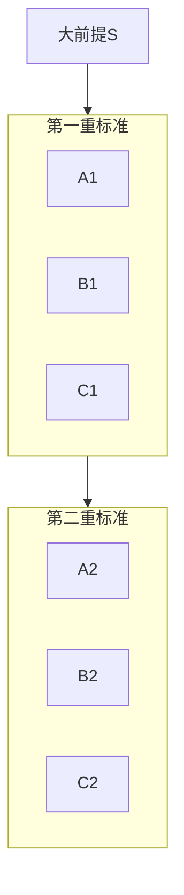

# 作文

---

## 总纲

### 论十五大关系

1. 因果
2. 递进
3. 条件
4. 并列（不推荐）
5. 对比
6. 对立统一
7. 主次关系
8. 表里关系
9. 量变质变
10. 普遍特殊
11. 转化
12. 继承发展
13. 起点终点
14. 手段目标
15. 局部整体

### 方法

```mermaid
graph TD
subgraph 论述
end
开头 --> 观点 --> 论述 --> 结合实际 -->
```

#### 二元思辨

要素：
- 大前提
- 二元
- 可能有隐藏的第三元，作为论敌



#### 三元思辨

- 概括三元
- 在统一标准下对比三元


