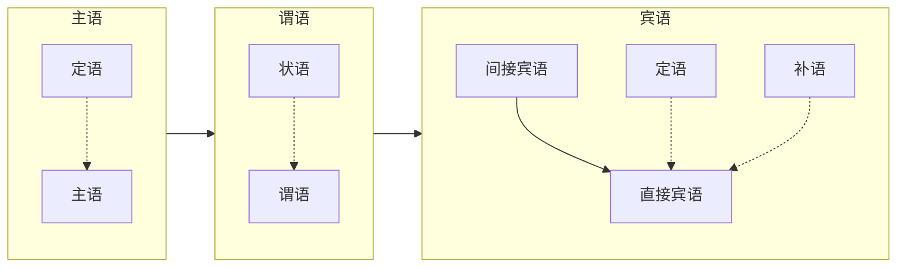

# 基本语法

## 词

|类|项|值|
|-|-|-|
|实词|名词|表示人和事物的名称的实词|
||动词|表示人或事物的动作、行为、发展、变化|
||形容词|表示事物的形状、样式、性质等|
||数词|表示事物数目的词|
||量词|表示事物或动作单位的词|
||代词|代替其他的词或者短语、句子的词|
|虚词|副词|用在动词形容词前面做状语|
||介词|同其他的词组合在一起，构成介词短语，做定语、状语和补语|
||连词|连接词、短语、句子乃至段落|
||助词|附加在词、短语、句子上起辅助作用|
||叹词|表示感叹、呼唤、应答的词|
||拟声词|模拟声音|

## 短语

|项|值|
|-|-|
|联合短语|由地位平等的词组成的短语|
|偏正短语|偏正短语中的一部分是中心词，前面总是有修饰语|
|补充短语|补充成分在后面的短语|
|动宾短语|动词后面带着宾语的短语|
|主谓短语|被陈述对象在前，陈述者在后构成的短语|
|介词短语|介词在前，其他词语（主要名词或者名词短语）在后组成的短语|
|的字短语|用“的”在最后组成的短语，相当于一个名词|

## 句子

主语、谓语、宾语、定语、状语、补语

