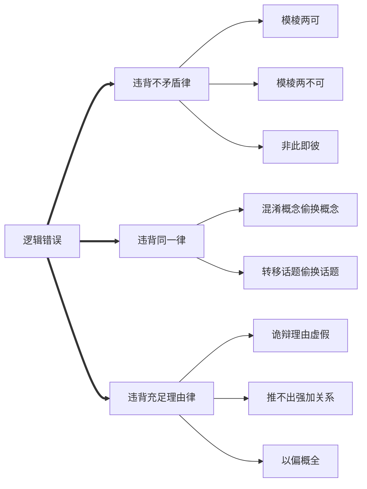

# 逻辑推理

---

# 逻辑

| 推理类型 | 充分     | 必要     | 充要        |
| ---- | ------ | ------ | --------- |
| 基本   | 有 p 一定有 q | 无 p 一定无 q | 有 p 有 q，有 q 有 p |
| 有效   |        |        |           |
| 无效   |        |        |           |
