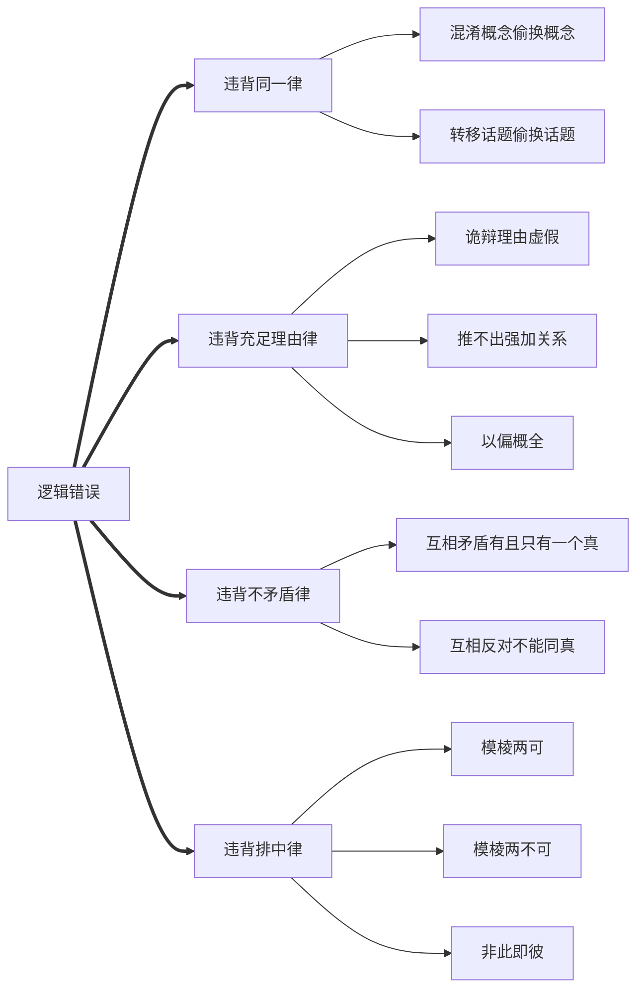

# 逻辑推理

---

## 逻辑

| 逻辑错误  | 分析                                     |
| ----- | -------------------------------------- |
| 同一律   | 同一思维过程中概念和判断有同一性，始终保持如一，不混淆偷换概念、转移偷换论题 |
| 充足理由律 | 一个被断定为真的判断具有充足的理由                      |
| 不矛盾律  | 两个反对或矛盾的判断不能同真，必有一假                    |
| 排中律   | 两个互相矛盾的命题不能同假，必有一真                     |

## 推理

| 推理类型 | 充分        | 必要        | 充要              |
| ---- | --------- | --------- | --------------- |
| 基本   | 有 p 一定有 q | 无 p 一定无 q | 有 p 有 q，有 q 有 p |
| 有效   |           |           |                 |
| 无效   |           |           |                 |

### 三段论

- 所有 M 都是 P（大前提，含大项 P）
- 所有 S 都是 M（小前提，含小项 S）
- 所有 S 都是 P（主项 S，谓项 P）

### 充分条件推理

如果 p（前件），那么 q（后件）

- 肯前必肯后：如果 p 那么 q，是 p 所以是 q
- 否后必否前：如果 p 那么 q，非 p 所以非 q

### 必要条件推理

只有 p（前件），才有 q（后件）

- 肯后必肯前：只有 p 才 q，是 q 所以是 p
- 否前必否后：只有 p 才 q，非 p 所以非 q

### 排除法

n 种可能排除 (n-1) 种最后一种必然

### 二难推理

不同情况导致同样的结果，这个结果就是必然的

### 归纳推理

抓住个性，推知共性

### 类比推理

由一些属性相似推出其他属性相似

## 逻辑谬误

### 歪曲观点

歪曲对方观点，然后攻击

### 偷换论题

转移到另一个话题，逃避质疑攻击

### 假二择一

把多种可能说成两种可能，迫使对方做出自己希望的选择

### 两可两不可

同时肯定或否定，模棱两可

### 不当预设

隐藏前提，无论如何回答都意味着承认前提

### 轻率归纳

考察过少、样本无代表性

### 不当类比

比对没有可比性，“假相似”对象进行比对，进而得出结论

### 强加因果

因为时间等表面联系就看成因果事件

### 循环论证

待证明的结论出现在前提
