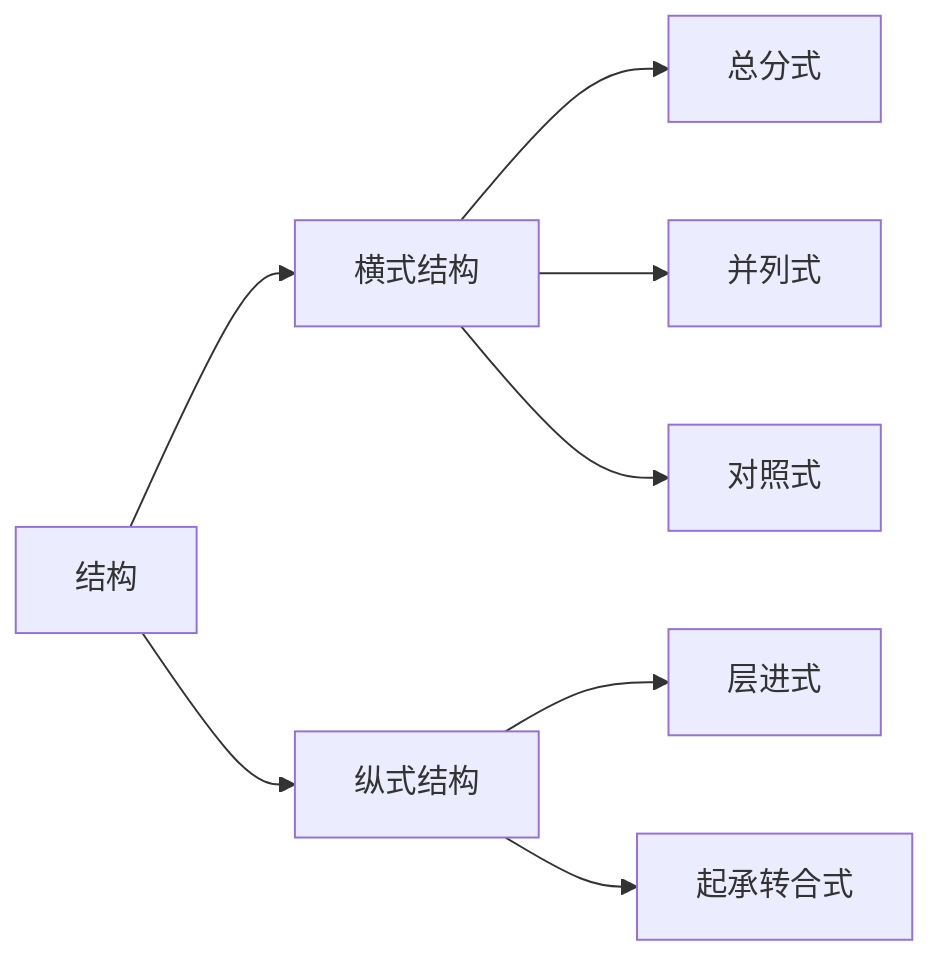

# 议论文

## 结构

## 论据

- 道理论据
- 事实论据

## 论证方式

- 立论
- 驳论

## 论证方法

|名称|作用|
|-|-|
|举例论证|具体有力|
|道理论证|充分有力|
|对比论证|鲜明突出|
|比喻论证|生动形象|

## 语言

- 准确性 严密性
- 生动性 形象性

## 段落

|位置|方面|作用|
|-|-|-|
|开头|内容|引出中心论点/论题|
|||论证论点|
|||激发阅读兴趣|
||结构|开门见山/引出下文/照应题目|
|中间|内容|具体情况具体分析|
||结构|引出下文/照应上文|
|||承上启下|
|结尾|内容|总结全文，提出论点|
|||强调中心论点|
|||补充论证|
|||发出号召/引人思考|
||结构|照应题目/开头/上文|
