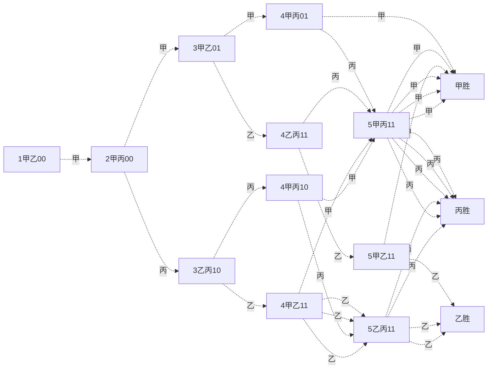

# 累计败两场淘汰

```mermaid
graph LR
1甲乙00-.甲.->2甲丙00-.甲.->3甲乙01-.甲.->4甲丙01-.甲.->甲胜
                                          4甲丙01-.丙.->5甲丙11-.甲.->甲胜
                                                        5甲丙11-.丙.->丙胜
                            3甲乙01-.乙.->4乙丙11-.乙.->5甲乙11-.甲.->甲胜
                                                        5甲乙11-.乙.->乙胜
                                          4乙丙11-.丙.->5甲丙11-.甲.->甲胜
                                                        5甲丙11-.丙.->丙胜
              2甲丙00-.丙.->3乙丙10-.乙.->4甲乙11-.甲.->5甲丙11-.甲.->甲胜
                                                        5甲丙11-.丙.->丙胜
                                          4甲乙11-.乙.->5乙丙11-.乙.->乙胜
                                          4甲乙11-.乙.->5乙丙11-.丙.->丙胜
                            3乙丙10-.丙.->4甲丙10-.甲.->5甲丙11-.甲.->甲胜
                                                        5甲丙11-.丙.->丙胜
                                          4甲丙10-.丙.->5乙丙11-.乙.->乙胜
                                          4甲乙11-.乙.->5乙丙11-.丙.->丙胜
```
