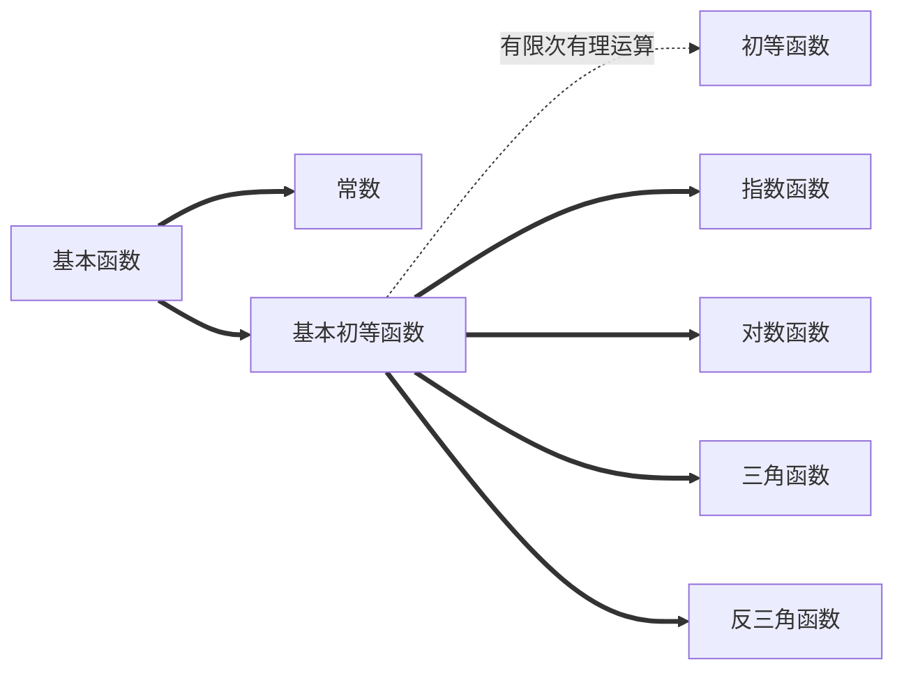

# 导数&微积分

---

> ~~"How to ask the guidance for help?"~~
> "How to find the derivative of a function"

## 函数

---

## 导数

---

> 一个函数在某一点的导数描述了这个函数在这一点附近的变化率
>
> 几何意义：表示函数曲线在点$P_0(x_0, f(x_0))$处的切线的斜率

函数$y=f(x)$在$x_0$某邻域有定义则：
$f^ \prime (x)=\lim\limits_{\Delta x\to +0}\tfrac{\Delta y}{\Delta x}$

### 导数性质

$[u(x)\pm v(x)]^\prime = u^\prime (x)+v^\prime (x)$

$[u(x)v(x)]^\prime = u^\prime (x)v(x)+v^\prime (x)u(x)$

$[\dfrac{u(x)}{v(x)}]^\prime = \dfrac{u^\prime (x)v(x)-v^\prime (x)u(x)}{v^2(x)}$

$y=f(u), u=g(x)\Longrightarrow \dfrac{\mathrm d y}{\mathrm d x} = f^\prime (u)g^\prime (x)$

> 以此类推：
> $y=f(u),u=\phi (v),v=\psi (x) \Longrightarrow \dfrac{\mathrm d y}{\mathrm d x} = \dfrac{\mathrm d y}{\mathrm d u} \cdot \dfrac{\mathrm d u}{\mathrm d v} \cdot \dfrac{\mathrm d v}{\mathrm d x} = f^\prime (u) \cdot ^\prime (v) \cdot \psi ^\prime (x)$

### 初等函数求导

$(C)^\prime = 0$

$(x^\mu)^\prime = \mu x^{\mu -1}$

$(\sin x)^\prime = \cos x$

$(\cos x)^\prime = -\sin x$

$(a^x)^\prime = a^x\ln a$

$(e^x)^\prime = e^x$

$(\log_ax)^\prime = \dfrac{1}{x\ln a}$

$(\ln x)^\prime =\dfrac{1}{x}$

## 微分

---

> 几何意义：表示函数曲线在点$P_0(x_0, f(x_0))$处的切线纵坐标增量

$\Delta y=f(x_0+\Delta x)-f(x_0)=A\Delta x+o(\Delta x)$则函数$y=f(x)$在点$x_0$处可微，$A\Delta x$称为$f(x)$在点$x_0$处的微分，记作$\mathrm d y$或$\mathrm d f$即$\mathrm d y=A\Delta x=f^\prime (x_0)\Delta x$

### 微分性质

$\mathrm d (u\pm v)=\mathrm d u\pm\mathrm d v$

$\mathrm d (Cu)=C\mathrm d u$

$\mathrm d (uv)=v\mathrm d u+u\mathrm d v$

$\mathrm d (\dfrac{u}{v})=\dfrac{v\mathrm d u-u\mathrm d v}{v^2}$

$y=f(u),u=\phi (x)\Longrightarrow \mathrm d y=y_x^\prime\mathrm d x=f^\prime (u) \phi ^\prime \mathrm d x \Longrightarrow \mathrm d y=f^\prime (u) \prime d u$

### 微分应用：近似求$f(x)$

$\Delta u = f^\prime (x_0)+o(\Delta x)$

当$\lvert \Delta x \rvert$很小时，得近似等式：

$\Delta y = f(x_0+\Delta x)-f(x_0)\approx f^ \prime (x_0)\Delta x \Longrightarrow f(x_0+\Delta x)\approx f(x_0)+f^\prime(x_0)\Delta x$

换元得：

$f(x)\approx f(x_0)+f^\prime (x_0)(x-x_0)$

特别当$x_0=0,\lvert x\rvert$很小时：

$f(x)\approx f(0)+f^\prime (0)x$

## 积分

---

### 泰勒公式

$f(x)\approx f(x_0)+f^\prime (x_0)(x-x_0)$

提高精度，估计误差

$f(x) = f(x_0)+f^\prime (x_0)(x-x_0)+\dfrac{f^{\prime\prime}(x_0)}{2!}(x-x_0)^2+\cdots +\dfrac{f^{(n)}(x_0)}{n!}(x-x_0)^n+\dfrac{f^{n+1}(\xi)}{(n+1)!}(x-x_0)^n+1,\xi \in [x_0,x]$

取$x_0 = 0,\xi = \theta x,0<\theta <1$得麦克劳林公式

$f(x) = f(0)+f^\prime (0)x+\dfrac{f^{\prime\prime}(0)}{2!}x^2+\cdots +\dfrac{f^{(n)}(0)}{n!}x^n+\dfrac{f^{n+1}(\theta x)}{(n+1)!}x^n+1 \Longrightarrow f(x) \approx f(0)+f^\prime (0)x+\dfrac{f^{\prime \prime}(0)}{2!}x^2+\cdots +f^\prime (0)x+\dfrac{f^{(n)}(0)}{n!}x^n$

### 不定积分

> $f(x)$的原函数，记作$\int f(x)\mathrm d x$，求一个函数的原函数，微分的逆运算，是一个表达式
> 几何意义：$f(x)$的原函数的图形称为$f(x)$的积分曲线
> $\int f(x)\mathrm d x$的图形为$f(x)$所有积分曲线组成的平行线族

$\mathrm d [\int f(x)\mathrm d x]=f(x)\mathrm d x$
$\int F^\prime (x)\mathrm d x = F(x)+C$

#### 积分运算

$\int k f(x)\mathrm d x=k\int f(x)\mathrm d x +C$
$\int [f(x)\pm g(x)]\mathrm d x=\int f(x)\mathrm d x\pm \int g(x)\mathrm d x$

#### 分部积分

$(uv)^\prime=u^\prime v+v^\prime u \Longrightarrow uv=\int u^\prime v\mathrm d x+\int v^\prime u\mathrm d x$

### 定积分

> 设函数$f(x)$定义在$[a,b]$上，若对$[a,b]$任一种分法$a=x_0<x_1<\cdots<x_n=b$令$\Delta x_i=x_i-x_{i-1}$任取$\xi _i\in [x_{i-1},x_i]$只要$\lambda=\max\limits_{1\leq i\leq n}{\{x_i\}}\rightarrow 0$时$\sum\limits_{i=1}^n f(\xi _i)\Delta x_i$总有确定的极限$I$则$I$为$f(x)$在$[a,b]$上的定积分，记作$\int_a^bf(x)\mathrm d x=\lim\limits_{\lambda \rightarrow 0}\sum\limits_{i=1}^n f(\xi _i)\Delta x_i$

|式|理解|
|-|-|
|$\Delta x_i=x_i-x_{i-1}$|分割|
|$\xi _i\in [x_{i-1},x_i]$|取样|
|$\lambda=\max\limits_{1\leq i\leq n}{\{x_i\}}\rightarrow 0$|分割无限小|
|$\sum\limits_{i=1}^n f(\xi _i)\Delta x_i$|面积|

> 几何意义
> $f(x)>0,\int_a^bf(x)\mathrm d x=A$
> $f(x)<0,\int_a^bf(x)\mathrm d x=-A$

#### 性质

- $\int_a^bf(x)\mathrm d x=-\int_b^af(x)\mathrm d x\Longrightarrow \int_a^af(x)\mathrm d x=0$
- $\int_a^b\mathrm d x=b-a$
- $\int k f(x)\mathrm d x=k\int f(x)\mathrm d x +C$
- $\int [f(x)\pm g(x)]\mathrm d x=\int f(x)\mathrm d x\pm \int g(x)\mathrm d x$

#### 计算

看完才懂<https://zhuanlan.zhihu.com/p/453108063>

##### 不定积分+牛顿-莱布尼兹公式

$\int_a^bf(x)\mathrm d x=F(b)-F(a)=F(x)\bigg|_a^b$

##### 按照定义

$\int_a^bf(x)\mathrm d x=\lim\limits_{\lambda \rightarrow 0}\sum\limits_{i=1}^n f(\xi _i)\Delta x_i$

###### 求和

> $a_1+a_2+\cdots +a_n=\sum\limits_{k=1}^n a_k$

**性质：**

- $\sum\limits_{k=1}^n a_k=\sum\limits_{k=1}^ma_k+\sum\limits_{k=m+1}^ma_k,1<m<n$
- $\sum\limits_{k=1}^n (a_k+b_k)=\sum\limits_{k=1}^ma_k+\sum\limits_{k=1}^mb_k$
- $\sum\limits_{k=1}^n ra_k=r\sum\limits_{k=1}^ma_k$

**伸缩求和：**

$\sum\limits_{i=a}^b[f(i)-f(i-1)]=f(b)-f(a-1)$

这可以抵消

##### 奇偶性/对称性

###### 奇偶性

奇函数在正负对称区间上的积分为$0$

###### 对称性

在区间$[a,b]$上有一点$x$，则它关于区间对称轴的对称点为$a+b-x$，$\int_a^bf(x)\mathrm d x=\int_a^bf(a+b-x)\mathrm d x$（区间再现公式）

##### 更多更抽象的方法$\cdots,:($
