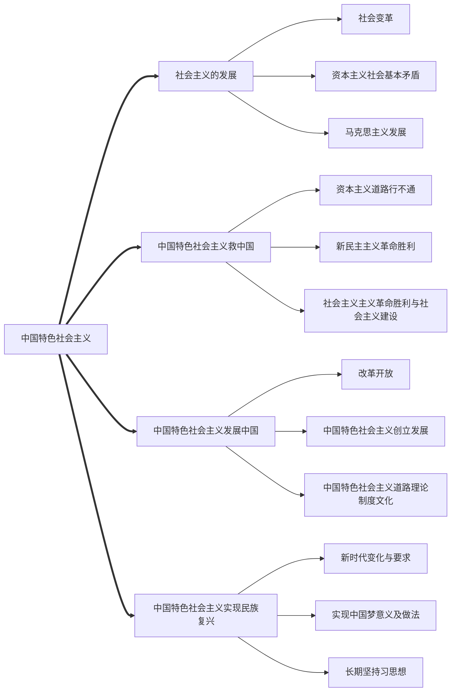

# 中国特色社会主义

```mermaid
graph LR
中国特色社会主义 ==> 社会主义的发展
中国特色社会主义 ==> 中国特色社会主义救中国
中国特色社会主义 ==> 中国特色社会主义发展中国
中国特色社会主义 ==> 中国特色社会主义实现民族复兴
社会主义的发展 --> 社会变革
社会主义的发展 --> 资本主义社会基本矛盾
社会主义的发展 --> 马克思主义发展
中国特色社会主义救中国 --> 资本主义道路行不通
中国特色社会主义救中国 --> 新民主主义革命胜利
中国特色社会主义救中国 --> 社会主义主义革命胜利与社会主义建设
中国特色社会主义发展中国 --> 改革开放
中国特色社会主义发展中国 --> 中国特色社会主义创立发展
中国特色社会主义发展中国 --> 中国特色社会主义道路理论制度文化
中国特色社会主义实现民族复兴 --> 新时代变化与要求
中国特色社会主义实现民族复兴 --> 实现中国梦意义及做法
中国特色社会主义实现民族复兴 --> 长期坚持习思想
```
