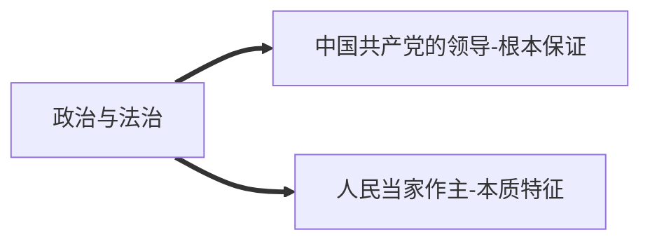
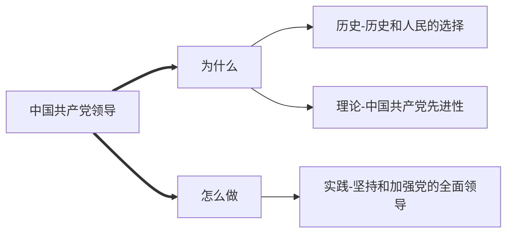
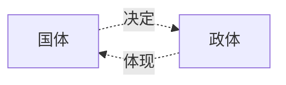

# 政治与法治

[[必修二]][[必修四]]

---

## 中国共产党的领导

---

### 历史和人民的选择

> 为什么中国共产党领导中华民族的伟大复兴是历史的选择、是人民的选择、是正确的选择？
> 为什么没有共产党就没有新中国，就没有中华民族伟大复兴？

## 中国共产党先进性

> 中国共产党为什么始终坚持以人民为中心
> 中国共产党怎样坚持以人民为中心
> 中国共产党为什么是具有先进性的政党

| Item                                 | value                                        |
| ------------------------------------ | -------------------------------------------- |
| 性质                                 | 工人阶级的先锋队，中国人民和中华民族的先锋队 |
| 根本宗旨                             | 全心全意为人民服务                           |
| 根本立场                             | 人民立场                                     |
| 初心使命                             | 为中国人民谋幸福，为中华民族谋复兴           |
| 执政理念                             | 立党为公，执政为民                           |
| 指导思想                             | 马克思列宁主义                               |
|                                      | 毛泽东思想                                   |
|                                      | 邓小平理论                                   |
|                                      | “三个代表”重要思想                           |
|                                      | 科学发展观                                   |
|                                      | 习近平新时代中国特色社会主义思想             |
| 始终走在时代前列，永葆生机活力的法宝 | 解放思想、实事求是、与时俱进、求真务实       |
| 坚强保证                             | 共产党员先锋模范作用                         |
|                                      |                                              |

## 坚持和加强党的全面领导

> 为什么坚持中国共产党领导
> 中国共产党为什么做

- 坚持党的领导
	- 特点
	- 方式
		1. 政治领导
		2. 思想领导
		3. 组织领导
	- 怎么做
- 坚持全面从严治党
	- 为什么
	- 怎么做
		1. 科学执政
		2. 民主执政
		3. 依法执政
---

## 人民当家作主

---

### 人民民主专政的社会主义国家

> 国家为什么做？

- 我国国体：人民民主专政的社会主义国家
- 全过程人民民主
- 人民民主专政

### 我国根本政治制度

> 人大为何做？
> 人大代表为何做？
> 人大代表怎么做？

区分：

- 人民代表大会制度
- 人民代表大会
- 全国人民代表大会
- 全国人民代表大会常务委员会
- 人大代表

### 我国基本政治制度

> 民主党派/政协为何做？
> 政协如何通过履行职责更好发挥协商作用？
> 为什么要坚持…制度
> 民族自治地方取得成就原因
> 如何实践基层民主

---

## 全面依法治国

---

### 治国理政的基本方式

> 法律阶级性
> 法律定义
> 新中国法治建设成就
> 全面依法治国意义、原则

### 法治中国建设

| 目标   | 主体   | 基础   |
| ---- | ---- | ---- |
| 法治国家 | 法治政府 | 法治社会 |

> 内涵、做法

### 全面推进依法治国基本要求

| 科学立法 | 严格执法 | 公正司法  | 全民守法 |
| ---- | ---- | ----- | ---- |
| 前提   | 关键   | 防线    | 保障   |
| 人大   | 政府   | 法院检察院 | 公民   |

> 内涵、做法
