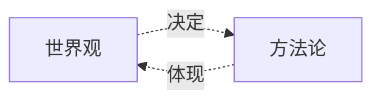

# 哲学与文化

[[Politics/必修三]]

---

## 探索世界与把握规律

---

### 时代精神的精华

> 哲学是具体化的世界观与方法论
> 哲学与具体科学辩证关系
> 存在是本源，思维和存在有同一性
> 马克思主义哲学基本特征

### 探究世界本质

> 自然界、人类社会物质性
> 意识是物质世界长期发展产物
> 运动是物质固有根本属性存在方式
> 运动有规律性
> 发挥主观能动性
