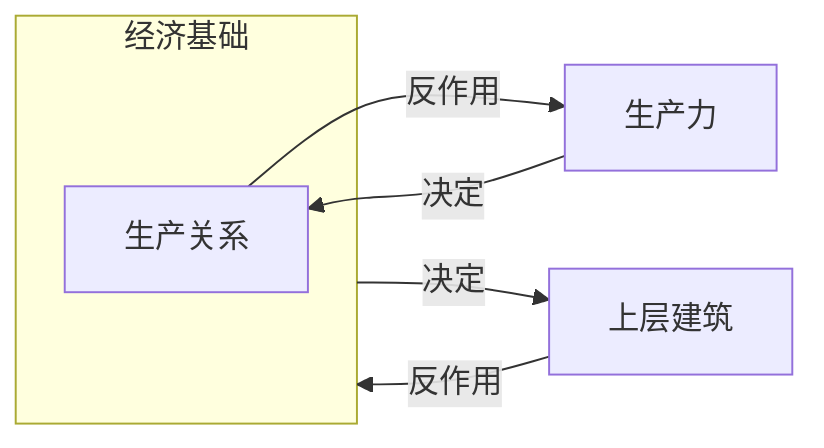
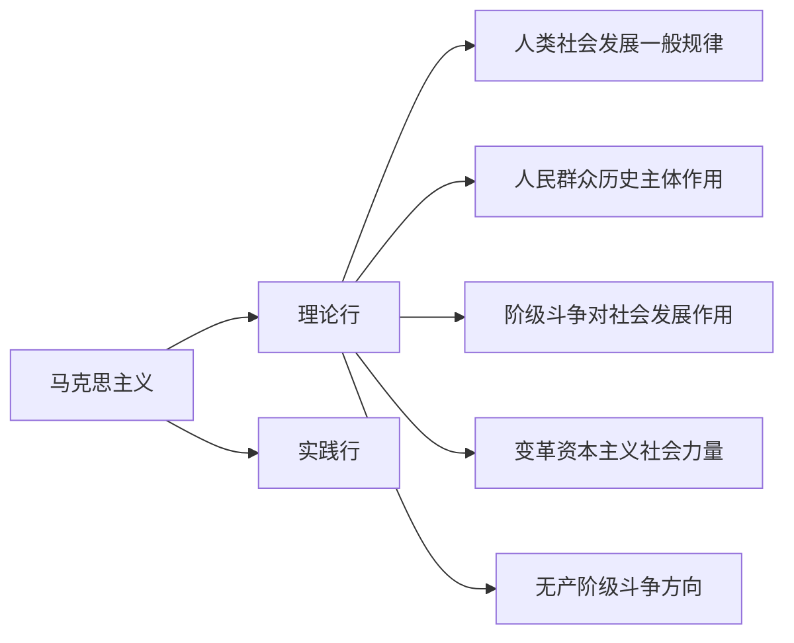

# 中国特色社会主义

## 社会主义从空想到科学、从理论到实践的发展

|生产力|生产关系|经济基础|上层建筑|
|-|-|-|-|
|劳动者（活跃因素）、劳动工具、劳动对象|生产资料所有制、人与人关系、分配制度|生产关系总和|国家、宗教、法律、文化等|

```mermaid
graph LR
subgraph 经济基础
  生产关系
end
生产力 --决定--> 生产关系
生产关系 --反作用--> 生产力
经济基础 --决定--> 上层建筑
上层建筑 --反作用--> 经济基础
```

```mermaid
graph LR
马克思主义 --> 理论行

马克思主义 --> 实践行

理论行 --> 人类社会发展一般规律
理论行 --> 人民群众历史主体作用
理论行 --> 阶级斗争对社会发展作用
理论行 --> 变革资本主义社会力量
理论行 --> 无产阶级斗争方向
```
