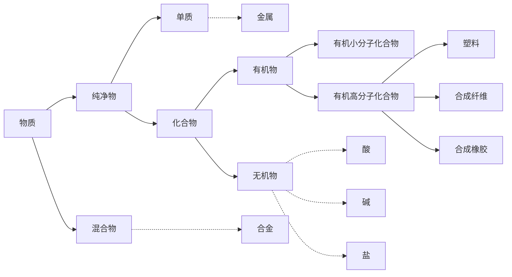

# 化学

## 物质

### 金属

| 性质     | 内容       |          |          |        |
| -------- | ---------- | -------- | -------- | ------ |
| 物理性质 | 金属光泽   | 导电性   | 导热性   | 延展性 |
| 化学性质 | 与氧气反应 | 与酸反应 | 与盐反应 |

**合金**
金属 + 金属/非金属
硬度大、熔点低、抗腐蚀性好、颜色鲜艳
**活动性**

K > Ca > Na > Mg > Al > Zn > Pb > (H) > Cu > Hg > Ag > Pt > Au

### 酸碱盐

酸：

- 使酸碱指示剂变色
- 与活泼金属反应
- 与碱反应
- 与盐反应

碱：

- 使酸碱指示剂变色
- 与部分非金属氧化物反应，**不是复分解反应**
- 与酸反应
- 与盐反应

盐：

- 与较活泼金属反应
- 与酸反应
- 与碱反应
- 与盐反应

## 化学反应

- 化合反应
- 分解反应
- 置换反应
- > 一种单质与化合物反应生成另外一种单质和化合物
- 复分解反应
- > 由两种化合物互相交换成分，生成另外两种化合物的反应
  > **实质**：在水溶液中相互交换离子，结合成难电离的物质（沉淀、气体、水）使溶液中**离子浓度降低**

## 实验操作

如使用 C/CO，氧化还原反应的条件应为高温

铁制品锈蚀实验应使用蒸馏水

**天平**：

- 校零
- 游码
- 粉末：垫纸；易受潮 (NaOH)：烧杯

**玻璃棒**：

- 搅拌 (促进溶解/蒸发)
- 过滤时引流
