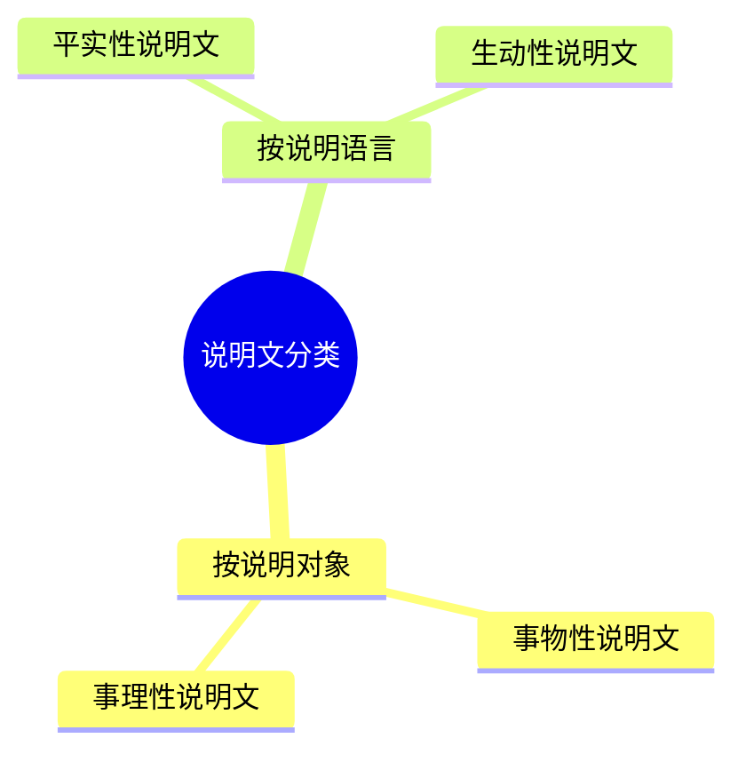

# 说明文

## 分类

## 说明顺序

- 时间顺序
- 空间顺序
- 逻辑顺序

## 说明方法

|方法|特点|
|-|-|
|举例子|具体有力|
|列数字|科学准确|
|作比较|突出强调|
|引资料|充分具体，文学性|
|打比方|形象生动，通俗易懂|
|作诠释|具体解释说明|
|下定义|科学准确，本质认识|
|摹状貌|具体形象|
|分类别|条理清晰|
|画图表|直观明了，一目了然|

## 语言

- 准确性、严谨性
- 生动性
- 文学性

## 句段作用

- 内容

> 1. 增加文学色彩
> 2. 激发阅读兴趣

- 结构
  - 开头

    > 1. 引出说明对象
    > 2. 引出下文

  - 中间

    > 3. 引出下文
    > 4. 承上启下
    > 5. 总结前文

  - 结尾

    > 6. 总结全文
    > 7. 呼应开头
    > 8. 结构严谨
    > 9. 发出呼吁
