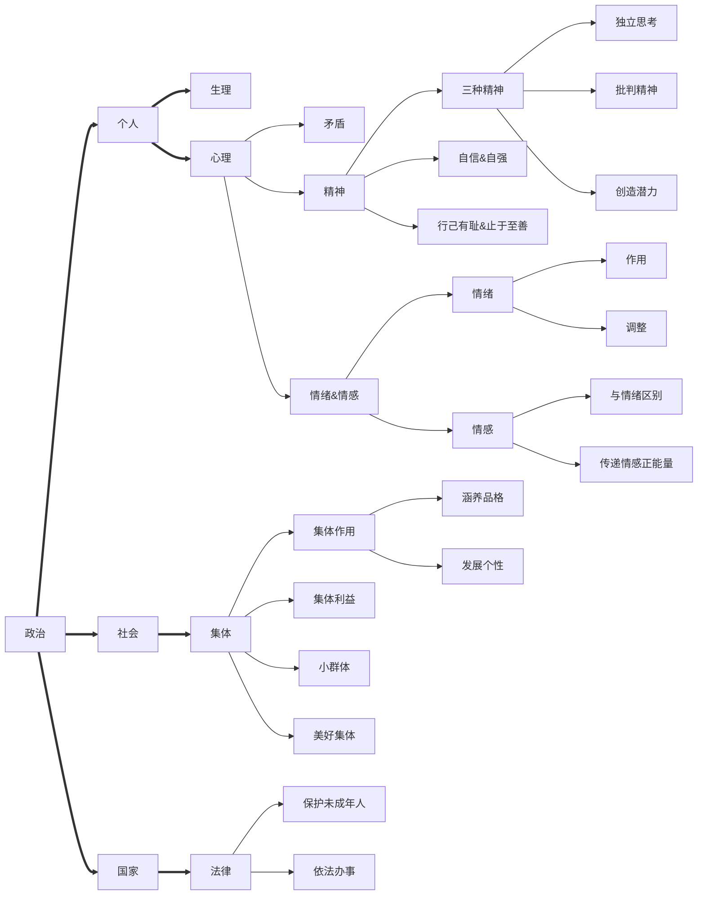

# 七年级下

```mermaid
graph LR
政治 ==> 个人
政治 ==> 社会
政治 ==> 国家

个人 ==> 生理
个人 ==> 心理 --> 矛盾
心理 --> 精神 --> 三种精神
三种精神 --> 独立思考
三种精神 --> 批判精神
三种精神 --> 创造潜力
精神 --> 自信&自强
精神 --> 行己有耻&止于至善
心理 --> 情绪&情感 --> 情绪
情绪&情感 --> 情感
情绪 --> 作用
情绪 --> 调整
情感 --> 与情绪区别
情感 --> 传递情感正能量

社会 ==> 集体
集体 --> 集体作用
集体 --> 集体利益
集体 --> 小群体
集体 --> 美好集体
集体作用 --> 涵养品格
集体作用 --> 发展个性

国家 ==> 法律
法律 --> 保护未成年人
法律 --> 依法办事
```
