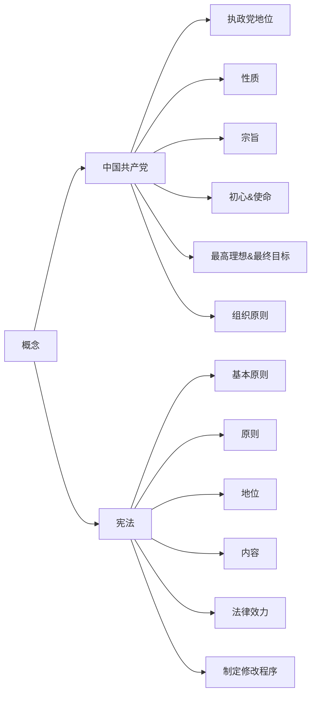
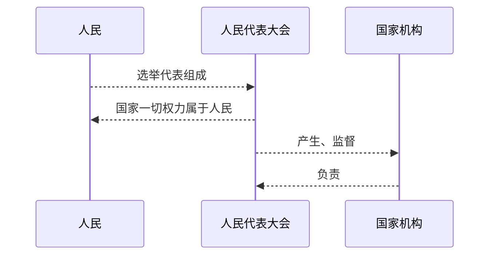
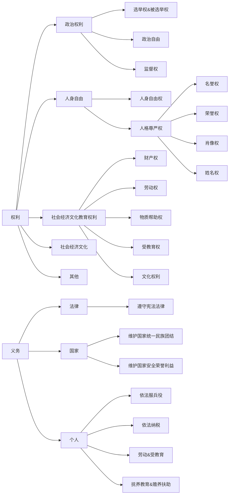
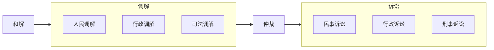
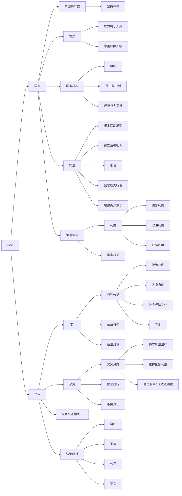

# 八年级下

## 概念

### 中国共产党

| 方面              | 内容                       |
| ----------------- | -------------------------- |
| 地位              | 执政党、本质特征、最大优势 |
| 性质              | 三个“先锋队”               |
| 宗旨              | 全心全意为人民服务         |
| 初心&使命         | 为人民谋幸福，为国家谋复兴 |
| 最高理想&最终目标 | 共产主义                   |
| 组织原则          | 民主集中制                 |
| 最高领导机关      | 党的全国代表大会           |
| 指导思想          | 马列主义等                 |

### 宪法

| 方面         | 内容                                       |
| ------------ | ------------------------------------------ |
| 基本原则     | 社会主义,权力属于人民                      |
| 原则         | 尊重和保障人权                             |
| 核心价值追求 | 规范国家权力以保障公民基本权利             |
| 地位         | 根本法,最高法律地位权威效力                |
| 内容         | 五部分四章 143 条，全局性、根本性          |
| 法律效力     | 最高                                       |
| 制定修改程序 | 严格，$\frac{1}{5}$ 提出，$\frac{2}{3}$ 通过 |
| 监督         | 全国人大及常委会                           |
| 解释         | 全国人大常委会                             |
| 保障实施     | 地方各级人大                               |



### 制度

| 性质         | 名称                                   |
| ------------ | -------------------------------------- |
| 根本制度     | 社会主义制度                           |
| 根本政治制度 | 人民代表大会制度                       |
| 基本政治制度 | 中国共产党领导的多党合作和政治协商制度 |
|              | 民族区域自治制度                       |
|              | 基层群众政治制度                       |
| 基本经济制度 | 公有制为主体、多种所有制经济共同发展   |
|              | 按劳分配为主体、多种分配方式并存       |
|              | 社会主义市场经济体制                   |

### 国家机构

#### 组织



#### 机构

| 国家机关           | 名称                                     | 性质                         | 职权/职能                                    |
| ------------------ | ---------------------------------------- | ---------------------------- | -------------------------------------------- |
| 国家权力机关       | （全国）人民代表大会                     | 人民行使国家权力的机关       | 立法、决定、任免、监督                       |
| 中华人民共和国主席 | 中华人民共和国主席                       | 代表中华人民共和国的国家机关 | 公布法律发布命令、任免权、外事权、授予荣誉权 |
| 国家行政机关       | 中央人民政府（国务院）、地方各级人民政府 | 国家权力机关执行机关         | 管理、服务                                   |
| 国家监察机关       | 监察委员会                               | 行使国家监察职能的国家机关   | 监督、调查、处置                             |
| 国家司法机关       | 人民法院                                 | 审判机关                     | 审判权                                       |
|                    | 人民检察院                               | 法律监督机关                 | 检察权                                       |

### 公民&人民

> **公民**：具有一国国籍，并根据该国宪法和法律的规定，享有权利并承担义务的一切社会成员
> **人民**：一切拥护社会主义和拥护祖国统一的社会力量和爱国者
> 公民比人民范围大，**依法被剥削政治权利的人和敌对分子不属于人民**
>
> ```mermaid
> graph LR
> 公民 --> 人民
> 公民 --> 敌人
> ```

### 权利&义务

#### 分类



#### 维权



### 法治精神

| 内容 | 内涵                               |
| ---- | ---------------------------------- |
| 自由 | 享有和正当行使的各项权利           |
| 平等 | 同等情况同等对待、不同情况差别对待 |
| 公平 | 权利公平、规则公平、机会公平       |
| 正义 | 促进社会进步维护公共利益行为       |

---

## 大纲


