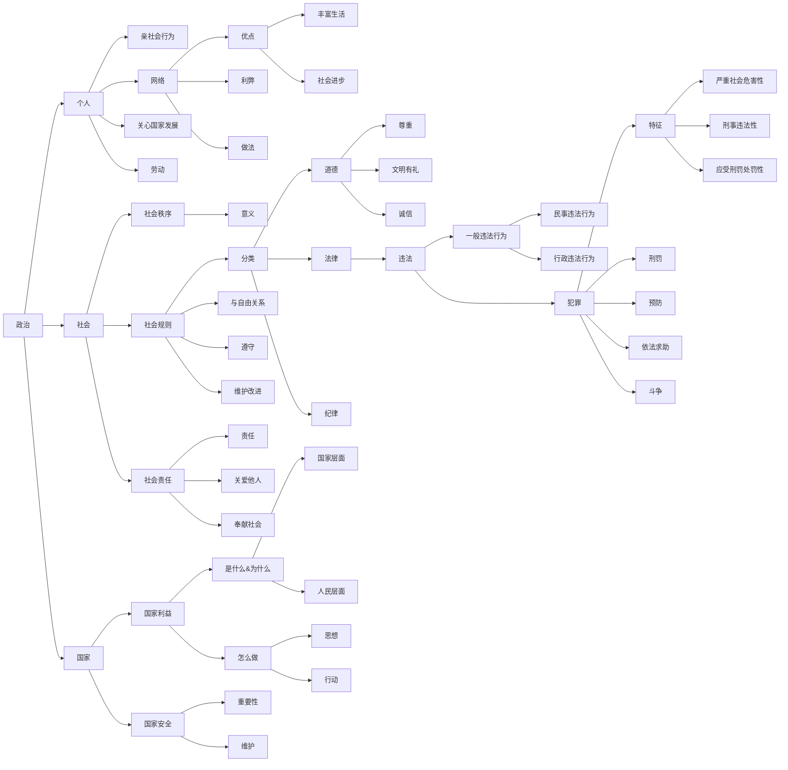

# 八年级上

```mermaid
graph LR
政治 --> 个人
政治 --> 社会
个人 --> 亲社会行为
个人 --> 网络 --> 优点 --> 丰富生活
优点 --> 社会进步
网络 --> 利弊
网络 --> 做法
道德 --> 尊重
道德 --> 文明有礼
道德 --> 诚信
个人 --> 关心国家发展
个人 --> 劳动

社会 --> 社会秩序 --> 意义
社会 --> 社会规则 --> 分类--> 道德
分类 --> 法律
分类 --> 纪律
社会规则 --> 与自由关系
社会规则 --> 遵守
社会规则 --> 维护改进

法律 --> 违法 --> 一般违法行为
一般违法行为 --> 民事违法行为
一般违法行为 --> 行政违法行为
违法 ---> 犯罪
犯罪 --> 特征
特征 --> 严重社会危害性
特征 --> 刑事违法性
特征 --> 应受刑罚处罚性
犯罪 --> 刑罚
犯罪 --> 预防
犯罪 --> 依法求助
犯罪 --> 斗争

社会 --> 社会责任 --> 责任
社会责任 --> 关爱他人
社会责任 --> 奉献社会

政治 --> 国家 --> 国家利益 --> 是什么&为什么
是什么&为什么 --> 国家层面
是什么&为什么 --> 人民层面
国家利益 --> 怎么做
怎么做 --> 思想
怎么做 --> 行动
国家 --> 国家安全 --> 重要性
国家安全 --> 维护
```
